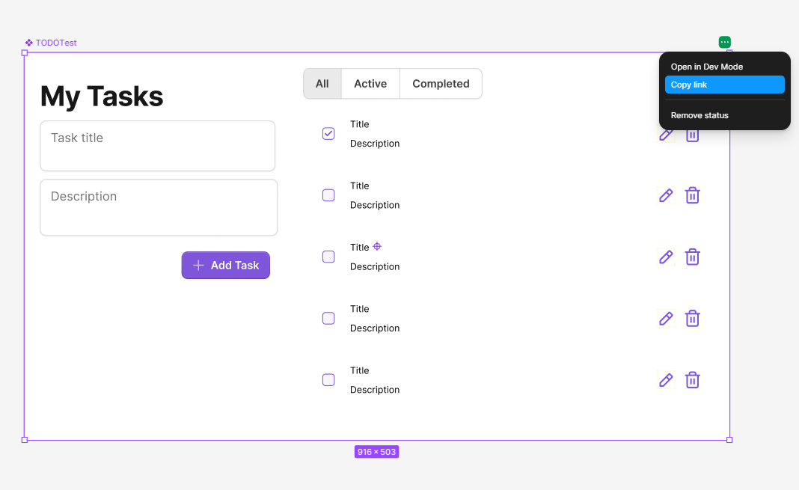

# Using AI to Code from a Figma Design

This guide explains how to use Claude Code with the Figma MCP integration to turn
Figma designs into real, reusable React components — no Pro plan required.

---

## How it works

Claude Code connects to Figma through an **MCP (Model Context Protocol)** server.
This means Claude can read your Figma files directly — inspecting frames, components,
colours, spacing, and more — and use that information to generate matching code.

You stay in your editor the whole time. No copy-pasting CSS, no guessing hex values.

---

## Option A vs Option B — what's the difference?

There are two ways to bridge Figma and code. This project uses **Option A**.

---

### Option A — Design → Code ✅ used in this project

> A developer reads a Figma design and generates React components from it.

- **Direction:** Figma → your codebase
- **Who benefits:** Developers
- **Figma plan:** Free (Starter) — no paid plan needed
- **What you get:** Reusable React components generated from your designs

**Use this when:**
- You are building from a designer's mockup
- You are on a free or Starter Figma plan
- You want to own the components directly in your codebase

---

### Option B — Code → Figma

> A developer links existing React components back into Figma so designers see real code in Dev Mode.

- **Direction:** your codebase → Figma
- **Who benefits:** Designers inspecting in Figma Dev Mode
- **Figma plan:** Pro (Dev Mode is a paid feature)
- **What you get:** Your actual component code shown inside Figma instead of auto-generated snippets

**Use this when:**
- You have a larger team with a dedicated designer
- Designers need to inspect designs and see your real component code
- You are on a Pro Figma plan

---

---

## Prerequisites

- Claude Code with the Figma MCP configured (already set up in this project)
- A Figma account with at least **view access** to the file you want to use
- The frontend project running (`cd FETODO && npm run dev`)

---

## Step-by-step workflow

### 1. Open your Figma file
Navigate to the frame or component you want to implement.

### 2. Copy the URL
Copy the full Figma URL from your browser. It looks like:
```
https://www.figma.com/design/XXXXXXXXXXXX/My-Design?node-id=1-2
```
The `node-id` parameter tells Claude exactly which frame to read.

To get the node-specific URL, right-click a frame in Figma and choose **Copy link**:



*The screenshot above shows the actual TODOTest frame used in this project — notice "Copy link" highlighted in the context menu. That URL is what you paste into Claude.*

### 3. Ask Claude to generate the component
Paste the URL into the Claude Code chat and describe what you want:

> "Read this Figma frame and generate a React + Tailwind component for it:
> https://www.figma.com/design/..."

Claude will:
1. Fetch the design from Figma
2. Inspect colours, typography, spacing, and layout
3. Generate a typed React component that matches

### 4. Review and save
The component lands in `FETODO/src/components/`. Review it, adjust any details,
and it is ready to import and reuse anywhere in the app.

---

## Tips

- **Be specific with the URL** — link to the exact frame, not just the file root.
  Grab the node-specific URL by right-clicking a frame in Figma → *Copy link*.
- **Reuse, don't regenerate** — once a component exists in `src/components/` you
  never need to go back to Figma for it. Just import it.
- **Iterate in chat** — if the generated component doesn't look right, describe
  what's off ("make the button full width", "use a lighter shadow") and Claude will
  update it without touching Figma again.
- **Tailwind tokens** — this project uses Untitled UI design tokens in
  `tailwind.config.js`. Claude is aware of them and will prefer those over
  arbitrary values.

---

## Figma MCP authentication

The Figma MCP server runs at:
```
https://mcp.figma.com/mcp
```

This is the endpoint Claude Code connects to in order to read your Figma files.
It is configured in your Claude Code MCP settings — no manual setup needed if
you followed the standard Figma MCP installation.

Authentication is handled automatically via the MCP connection. If you ever see a
permission error, check that:
1. You are logged into the correct Figma account in the MCP settings
2. You have at least **view** access to the Figma file
